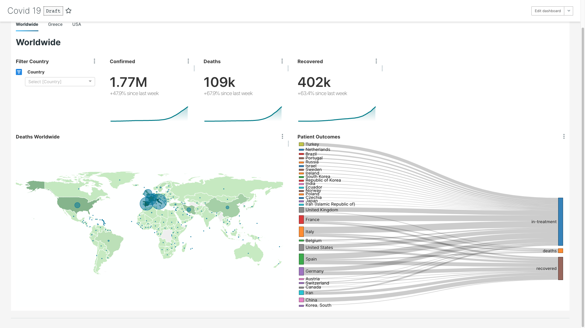
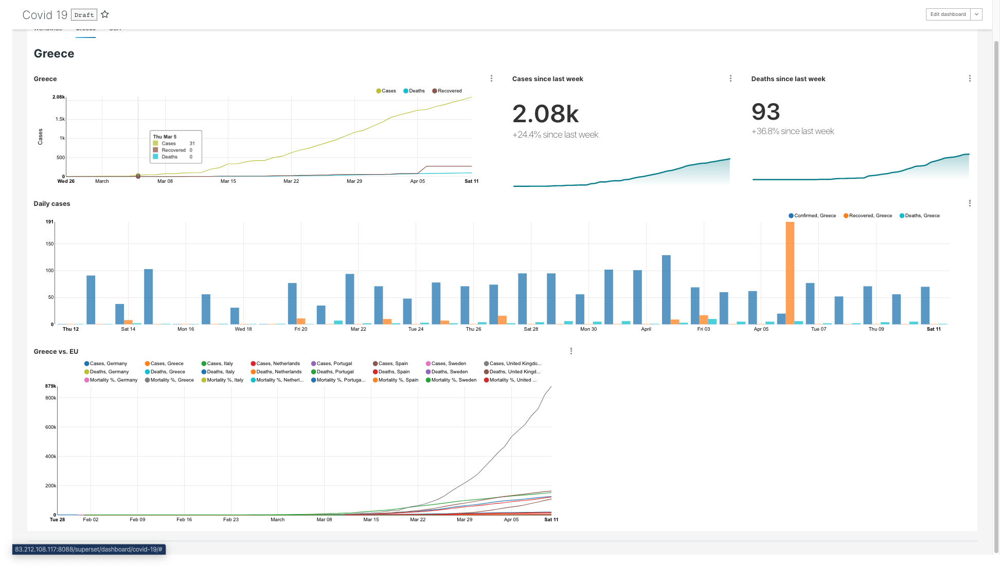
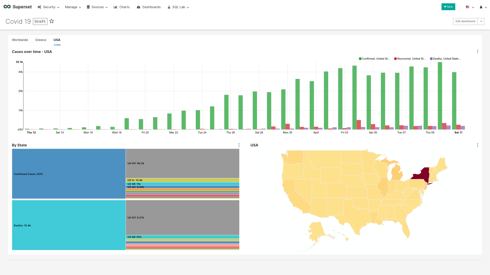

# covid19-dashboard
A daily updated Covid19 Dashboard implemented on [Apache Superset](https://github.com/apache/incubator-superset) based on the [CSSE COVID-19 Dataset](https://github.com/CSSEGISandData/COVID-19).

## Demo page

You can see a working instance of the dashboard at http://83.212.108.117:8088/superset/dashboard/covid-19/

Screens:





## Functionality 

Stay up to date with the Covid19 outbreak with your own personal dashboard, or experiment further with meaningful descriptive analytics.

See the curve flatten before your eyes.

The dashboard fetches global data as published in the daily report by [CSSE COVID-19 Dataset](https://github.com/CSSEGISandData/COVID-19), populates the Apache Superset postgres database and enables a tabbed Covid19 Anaytics dashboard.

---

## Instructions

1. Follow the instructions at [Superset-docker](https://github.com/apache/incubator-superset/tree/master/docker) to install Apache Superset on your environment. 
    1. In short, ```git clone```, then ```docker-compose up```
2. The ```data_import.sh``` script:
    1. ```git pull```s data from the [CSSE COVID-19 Dataset](https://github.com/CSSEGISandData/COVID-19)
    2. ```CREATE SCHEMA``` for the postgresdb, including tables and views needed for analysis:

        * a timeseries table with daily increments (```view::covid_pdf```)
        
        * a lookup table for location metadata (```table::covid_lookup```)

        * a United States abbreviation table

        * a view to support sunkey diagrams
    
    3. Populates the tables
    4. Performs post-processing on the data to fix various schema migrations in the raw data occurred on Feb-29, Mar-22, Apr-01
3. Add this entry to your crontab to allow daily data loading:

     ```echo "00,15,30,45 * * * * ${PWD}/data_import.sh" | crontab -```


4. Open Superset http://localhost:8088 (username/password admin/admin), add a new Source Database named **Covid19** with the following sqlalchemy string ```postgresql://superset:superset@db:5432/superset```
5. Go to Manage, Import Dashboard and upload ```dashboard.json``` to load the Dashboard
6. Explore the data via the SQL Lab
7. **Stay home!**


---
## References and Notes


Data are copyright 2020 Johns Hopkins University [CSSE COVID-19 Dataset](https://github.com/CSSEGISandData/COVID-19)

Apache Superset: [Apache Superset](https://github.com/apache/incubator-superset)
